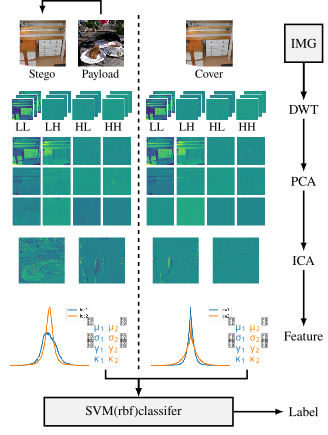

# Official repository for the paper :

## "On the Possible Detectability of Image-in-Image Steganography" 

### released at @[ICIP 2026](https://2026.ieeeicip.org/) (Tampere, Finland)

  

[](#CitingUs)   [](https://arxiv.org/abs/2603.11876)  

<p align="center">
  
</p>

### Antoine Mallet & Patrick Bas

<br/>

*Abstract : This paper investigates the detectability of popular image-in-image steganography 
schemes[^1][^2][^3][^4][^5].
In this paradigm, the payload is usually an image of the same size as the Cover image, 
leading to very high embedding rates.
We first show that the embedding yields a mixing process that is easily identifiable by independent component analysis.
We then propose a simple, interpretable steganalysis method based on the first four 
moments of the independent components estimated from the wavelet decomposition of the images, 
which are used to distinguish between the distributions of Cover and Stego components.
Experimental results demonstrate the efficiency of the proposed method, 
with eight-dimensional input vectors attaining up to **84.6\%** accuracy. 
This vulnerability analysis is supported by two other facts: the use of keyless 
extraction networks and the high detectability w.r.t. classical steganalysis methods, 
such as the SRM combined with support vector machines, which attains over **99\%** accuracy.*

[^1]: Junpeng Jing, Xin Deng, Mai Xu, Jianyi Wang, and
Zhenyu Guan, “Hinet: Deep image hiding by invertible
network,” *in Proc. of the IEEE/CVF international
conference on computer vision*, 2021.

[^2]: Hang Yang, Yitian Xu, Xuhua Liu, and Xiaodong Ma,
“Pris: Practical robust invertible network for image
steganography,” *Engineering Applications of Artificial
Intelligence, vol. 133*, 2024.

[^3]: Zhenyu Guan, Junpeng Jing, Xin Deng, Mai Xu,
Lai Jiang, Zhou Zhang, and Yipeng Li, “Deepmih:
Deep invertible network for multiple image hiding,”
*IEEE Transactions on Pattern Analysis and Machine
Intelligence, vol. 45*, 2022.

[^4]: Shumeet Baluja, “Hiding images within images,”
*IEEE transactions on pattern analysis and machine
intelligence, vol. 42*, 2019.

[^5]: Xinyu Weng, Yongzhi Li, Lu Chi, and Yadong Mu,
“High-capacity convolutional video steganography with
temporal residual modeling,” *in Proc. of the 2019 on
international conference on multimedia retrieval*, 2019.

##  Requirements

You can find the required dependencies in the ```requirements.txt``` file.


## Generating stego images

For generating stego images, you can look at the Github page of [HiNet](https://github.com/TomTomTommi/HiNet).
The GitHub page "[Hiding-images-within-images](https://github.com/albblgb/Hiding-images-within-images)" also proposes several models for performing image in image steganography.

## Generating Features

### SPAM features 

SPAM features can be generated using the ```generate_spam.py``` script.
To make it work, you only need to set the correct pathes where your images are (```line 451``` and ```line 459```),
and specify where you want to save your features (```line 452``` and ```line 460```).

### Moment-based features

The general method presented in the paper can be explored in the ```ica_moment.ipynb``` notebook.
It offers all the tools to perform the ICA on the Haar Wavelet decomposition, 
then extract the PCA subband, and compute the 1st, 2nd, 3rd, and 4th order moments.

## Training and evaluation


<a name="CitingUs"></a>
## Citing our paper
### If you wish to refer to our paper,  please use the following BibTeX entry
```BibTeX

@misc{mallet2026possibledetectabilityimageinimagesteganography,
      title={On the Possible Detectability of Image-in-Image Steganography}, 
      author={Antoine Mallet and Patrick Bas},
      year={2026},
      eprint={2603.11876},
      archivePrefix={arXiv},
      primaryClass={cs.CR},
      url={https://arxiv.org/abs/2603.11876}, 
}

```
## Acknowledgements

This work received funding from the French government grant
managed by the Agence Nationale de la Recherche under the
France 2030 program, reference ANR22-PECY-0011.